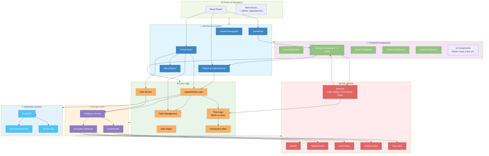

# ✂️ Rocha Barber - Sistema de Agendamentos Inteligente

Um sistema completo para barbearias que desejam elevar sua organização, atendimento e fidelização de clientes com planos mensais e gestão facilitada.

## Arquitetura do Sistema



---

## 📌 Visão Geral

O **Rocha Barber** é uma plataforma moderna e responsiva de agendamentos online, pensada para facilitar o dia a dia da barbearia, melhorar a experiência dos clientes e oferecer um painel administrativo completo.

### 🔑 Principais Recursos

* Agendamento de serviços online
* **4 tipos de serviços**: Corte (R$ 25), Barba (R$ 15), Corte + Barba (R$ 40), Plano Mensal (R$ 100)
* Planos mensais com controle de uso
* **Serviços de 1 hora**: Plano Mensal e Corte + Barba ocupam 2 slots consecutivos
* Gerenciamento de dias e horários de funcionamento
* Painel administrativo seguro com histórico separado
* Interface responsiva (mobile-first)
* Sistema de notificação por email

---

## ⚙️ Funcionalidades Detalhadas

### 🗓️ Agendamento de Serviços

* **4 tipos de serviços disponíveis**:
  - Corte de Cabelo (R$ 25,00) - 30 minutos
  - Barba (R$ 15,00) - 30 minutos  
  - Corte + Barba (R$ 40,00) - 1 hora
  - Plano Mensal (R$ 100,00) - 1 hora por atendimento
* **Lógica inteligente de horários**:
  - Serviços de 30 min: ocupam 1 slot
  - Serviços de 1 hora: requerem 2 slots consecutivos disponíveis
* Verificação automática de disponibilidade
* Suporte a planos mensais e agendamentos avulsos
* Interface intuitiva e adaptável a todos os dispositivos

### 💈 Planos Mensais

* Assinatura com **4 cortes mensais** por R\$ 120,00
* Renovação automática ao fim de cada mês
* Histórico de uso por até **12 meses**
* Visualização clara dos cortes disponíveis e utilizados
* **Atenção**: o nome usado nos agendamentos deve ser digitado exatamente igual para que o sistema reconheça o plano

### 📊 Painel Administrativo

* **Abas organizadas**:
  - Agendamentos (hoje e futuros)
  - Histórico (agendamentos passados)
  - Planos Mensais (controle de uso)
  - Configurações (dias e horários)
* Gerenciamento completo dos agendamentos
* Exclusão com lógica de planos mensais (+1 agendamento ao excluir)
* Configuração de dias e horários de funcionamento
* Monitoramento do uso dos planos mensais
* Autenticação segura de administradores
* Sistema de notificação por email para novos agendamentos

---

## 🧠 Armazenamento de Dados

### localStorage (uso principal)

* `appointments`: agendamentos
* `clientPlans`: planos ativos
* `workingDays`: dias disponíveis
* `timeSlots`: horários liberados

### IndexedDB (backup persistente)

* Banco de dados: `barberShopDB`
* Store: `data`
* Chaves utilizadas: `appointments`, `clientPlans`, `workingDays`, `timeSlots`

---

## 💻 Tecnologias Utilizadas

* **Frontend**: React + Vite
* **Estilização**: TailwindCSS
* **Armazenamento**: localStorage + IndexedDB
* **Deploy**: Vercel

---

## 📧 Sistema de Notificação

### Notificação por Email
* Email automático para `gabrielpikachuoficial@gmail.com` a cada novo agendamento
* Dados enviados: nome, telefone, serviço, preço, data, horário, tipo de plano
* Logs sempre funcionam no Vercel Dashboard > Functions > Logs
* Configuração opcional via EmailJS ou Formspree

### Como Configurar
1. **Formspree** (recomendado): Criar conta em formspree.io
2. **EmailJS**: Configurar service_id, template_id e user_id
3. **Logs**: Sempre disponíveis no Vercel para monitoramento

---

## 🚀 Melhorias Implementadas

### ✅ Verificação de Disponibilidade

* Filtro automático por dias de funcionamento
* Alertas claros para datas indisponíveis
* Tratamento robusto de datas para evitar problemas de fuso horário

### 📅 Organização de Horários

* Exibição ordenada dos horários disponíveis
* Interface clean e intuitiva

### 🧼 Modal de Exclusão

* Confirmação com detalhes do agendamento
* Estilo moderno com gradiente e animação
* Prevenção de exclusões acidentais

### 🧠 Inteligência nos Planos

* Renovação mensal automática
* Reversão automática em caso de cancelamento
* Histórico detalhado para o cliente
* **Lógica de exclusão**: Ao excluir agendamento de plano mensal, +1 agendamento é devolvido

### ⏰ Sistema de Horários Inteligente

* **Serviços de 30 minutos**: Corte e Barba ocupam 1 slot
* **Serviços de 1 hora**: Plano Mensal e Corte + Barba
  - Verificam 2 slots consecutivos disponíveis
  - Bloqueiam automaticamente ambos os horários
  - Exemplo: agendamento às 14:00 bloqueia 14:00 e 14:30

### 📱 Design Mobile-First

* Totalmente adaptável a celulares
* UX fluido e moderno em qualquer tela

### ❓ FAQ Integrado

* Dúvidas comuns respondidas de forma clara
* Orientações sobre o plano mensal e funcionamento

### 🪟 Sistema de Modais Otimizado

* Modais com dimensionamento automático (não esticados)
* Altura adaptativa baseada no conteúdo (`fit-content`)
* Rolagem vertical quando necessário
* Classe específica para modal de confirmação
* Design responsivo em todos os dispositivos

---

## 🌐 Implantação no Vercel

### Como publicar:

1. Faça um **fork** do repositório no GitHub
2. Conecte o repositório à sua conta Vercel
3. O projeto já possui o `vercel.json` configurado para:

   * Framework: **Vite**
   * Comando de build: `npm run build`
   * Diretório de saída: `dist`
   * Configurações para SPA com rotas client-side
   * Cache otimizado para assets estáticos

### Configurações importantes para o Vercel:

* O arquivo `vercel.json` já está configurado com:
  * Regras de rewrite para SPA (todas as rotas direcionadas para index.html)
  * Headers de cache otimizados (assets imutáveis com cache longo)
  * Configuração correta para o framework Vite

* O arquivo `vite.config.js` está configurado com:
  * Base path configurado como '/' para compatibilidade com Vercel
  * Source maps habilitados para melhor depuração
  * Otimização de bundle com Terser
  * Resolução de duplicações para evitar conflitos

* O arquivo `.vercelignore` exclui arquivos desnecessários do deploy

### Otimizações para deploy:

* Utilização de **HashRouter** em vez de BrowserRouter para melhor compatibilidade com hospedagem estática
* Caminhos absolutos para recursos estáticos (`/images/` em vez de `./images/`)
* Tratamento de erros robusto para evitar falhas silenciosas
* Redirecionamento de rotas não encontradas para a página inicial

### Sistema de Tratamento de Erros:

* **Fallback HTML** para erros de renderização no `main.jsx`
* **Detecção de falhas** de carregamento após 5 segundos no `index.html`
* **Mensagem amigável** para o usuário em caso de falha
* **Source maps** habilitados para melhor depuração em produção
* **Try/catch** em pontos críticos da aplicação para evitar quebras

### Navegação e Redirecionamentos:

* Links de navegação (Início, Serviços, Sobre, Contato) utilizam JavaScript para rolagem suave até as seções
* Botões "Agendar" redirecionam para a seção de serviços onde estão os cards
* Cards de serviço redirecionam para a página de agendamento
* Implementação de tratamento de erros para evitar tela branca em produção
* Correção de importações e exportações para garantir compatibilidade com o build

### Prevenção de Tela Branca:

* **Encapsulamento** da renderização em função com try/catch
* **Fallback visual** em HTML puro caso React falhe ao renderizar
* **Timeout de detecção** para identificar falhas de carregamento
* **Botão de recarga** para permitir que o usuário tente novamente
* **Mensagens de erro** amigáveis e instruções claras para o usuário

Após o deploy, seu sistema estará ativo com domínio próprio da Vercel.

---

## 🧪 Ambiente de Desenvolvimento Local

```bash
# Instalar dependências
npm install

# Iniciar em modo desenvolvimento
npm run dev

# Gerar build de produção
npm run build

# Visualizar build
npm run preview
```

---

## 💅 Guia de Estilização

### Modais

O sistema utiliza um conjunto de estilos CSS para garantir que os modais tenham aparência e comportamento consistentes:

```css
/* Estilos para modais */
.fixed.inset-0 {
  display: flex;
  align-items: center;
  justify-content: center;
  overflow: hidden;
}

.fixed.inset-0 > div {
  width: auto;
  max-width: 450px;
  min-width: 300px;
  margin: 0 auto;
  max-height: fit-content;
  overflow-y: auto;
  border-radius: 8px;
  box-shadow: 0 4px 6px rgba(0, 0, 0, 0.1);
}
```

Para modais de confirmação específicos, use a classe `.confirmation-modal`:

```css
.confirmation-modal {
  height: auto !important;
  align-self: flex-start;
  width: 100%;
}
```

---

## ❓ Perguntas Frequentes (FAQ)

### Como faço um agendamento?

Clique em "**Agende seu horário**", informe seu nome, selecione o serviço, escolha a data e o horário disponíveis. Após isso, você receberá a confirmação do agendamento.

### O que é o plano mensal?

Plano exclusivo com **4 cortes por mês por R\$ 120,00**, ideal para quem mantém o estilo sempre em dia. Os cortes renovam a cada mês automaticamente.

### Preciso usar o mesmo nome sempre?

Sim. Para que o sistema reconheça seu plano corretamente, **o nome informado deve ser sempre o mesmo**.

### Posso cancelar ou remarcar?

Sim. Entre em contato pelo WhatsApp com pelo menos **2 horas de antecedência**. Se tiver um plano mensal, o corte cancelado **retorna ao seu saldo**.

### Quais os horários de funcionamento?

Segunda a sexta-feira, das **8h às 18h**. A barbearia **não abre aos fins de semana**.

---

## 🔒 Segurança e Boas Práticas

* Autenticação de administrador com hash
* Validação de dados em tempo real
* Sanitização de entradas do usuário
* Confirmação para ações críticas (como exclusão de agendamentos)

---

## ⏰ Tratamento de Datas e Fuso Horário

O sistema implementa um tratamento especial para datas, evitando problemas comuns relacionados a fuso horário:

### Problema Resolvido

* Quando um cliente selecionava uma data (ex: 04/06/2025), o sistema às vezes exibia ou salvava como dia anterior (03/06/2025)
* Isso ocorria devido ao comportamento do JavaScript ao criar objetos Date a partir de strings no formato "YYYY-MM-DD"
* O JavaScript interpreta essas datas em UTC e depois converte para o fuso horário local, podendo causar mudança de dia

### Soluções Implementadas

1. **Formatação Direta de Strings**
   * Conversão direta de YYYY-MM-DD para DD/MM/YYYY usando `date.split('-').reverse().join('/')`
   * Evita completamente o uso de objetos Date para formatação simples
   * Implementado em `Agendamento.jsx` para exibição de datas nos modais de confirmação

2. **Uso de UTC para Cálculos**
   * Criação de datas usando `Date.UTC()` para garantir consistência
   * Uso de métodos `getUTCDate()`, `getUTCMonth()` e `getUTCDay()` para operações
   * Implementado em `database.js` para garantir consistência no armazenamento

3. **Formatação Manual de Datas**
   * Implementação de função personalizada para formatar datas com dia da semana
   * Arrays de nomes de dias e meses em português para formatação consistente
   * Implementado em `Admin.jsx` para exibição correta de datas no painel administrativo:
   ```javascript
   const formatDate = (dateString) => {
     // Dividir a string de data em partes (YYYY-MM-DD)
     const parts = dateString.split('-');
     if (parts.length !== 3) return dateString;
     
     // Obter os componentes da data
     const year = parseInt(parts[0], 10);
     const month = parseInt(parts[1], 10) - 1;
     const day = parseInt(parts[2], 10);
     
     // Nomes dos dias da semana e meses em português
     const weekdays = ['domingo', 'segunda-feira', 'terça-feira', 'quarta-feira', 'quinta-feira', 'sexta-feira', 'sábado'];
     const months = ['janeiro', 'fevereiro', 'março', 'abril', 'maio', 'junho', 'julho', 'agosto', 'setembro', 'outubro', 'novembro', 'dezembro'];
     
     // Calcular o dia da semana usando UTC para evitar problemas de fuso horário
     const date = new Date(Date.UTC(year, month, day));
     const weekday = weekdays[date.getUTCDay()];
     const monthName = months[month];
     
     // Formatar a data manualmente: "dia da semana, dia de mês de ano"
     return `${weekday}, ${day} de ${monthName} de ${year}`;
   };
   ```

4. **Ordenação Segura**
   * Comparação de datas usando componentes individuais (ano, mês, dia)
   * Evita problemas de ordenação causados por fuso horário
   * Implementado em `Admin.jsx` para ordenação correta de agendamentos

5. **Modificação em DateHelper.js**
   * Simplificação da função `formatDate` para evitar problemas de fuso horário
   * Conversão direta para formato DD/MM/YYYY sem usar objetos Date

Estas implementações garantem que as datas sejam exibidas e processadas corretamente em todos os ambientes, independentemente do fuso horário do servidor ou do cliente.
