# ✂️ Rocha Barber - Sistema de Agendamentos Inteligente

Um sistema completo para barbearias que desejam elevar sua organização, atendimento e fidelização de clientes com planos mensais e gestão facilitada.

## Arquitetura do Sistema

```mermaid
flowchart TD
    style U fill:#e1f5fe, color:#01579b
    style F fill:#f3e5f5, color:#4a148c
    style C fill:#e8f5e8, color:#1b5e20
    style S fill:#fff3e0, color:#e65100
    style D fill:#ffebee, color:#b71c1c
    style R fill:#f1f8e9, color:#33691e

    %% Camadas da Aplicação
    subgraph U[👤 Interface do Usuário]
        H[Header/Navegação]
        HP[HomePage]
        AG[Página de Agendamento]
        AD[Painel Admin]
    end

    subgraph F[🎨 Frontend Components]
        HC[Hero Component]
        SC[Services Component]
        AB[About Component]
        CT[Contact Component]
        FT[Footer Component]
        UI[UI Components<br/>Button, Input, Card, etc.]
    end

    subgraph C[⚙️ Core Logic]
        AP[Appointments Logic]
        PL[Plans Management]
        DH[Date Helper]
        AU[Auth Service]
    end

    subgraph S[💾 Storage Layer]
        LS[localStorage]
        SB[Supabase Database]
        DB[Database Service]
    end

    subgraph D[📊 Data Models]
        CL[Clients]
        APP[Appointments]
        CP[Client Plans]
        WD[Working Days]
        TS[Time Slots]
    end

    subgraph R[🌐 Routes & Navigation]
        MR[Main Routes<br/>/, /admin, /agendamento]
        RR[React Router]
    end

    %% Fluxo de Dados Principal
    U --> F
    F --> C
    C --> S
    S --> D

    %% Conexões específicas
    HP --> SC
    SC --> AG
    AG --> AP
    AP --> PL
    AP --> DB
    DB --> SB
    DB --> LS

    %% Admin Flow
    AD --> AU
    AU --> DB
    AD --> AP
    AD --> PL

    %% Data Flow
    SB --> CL
    SB --> APP
    SB --> CP
    LS --> WD
    LS --> TS

    %% Navigation
    R --> U
    RR --> HP
    RR --> AG
    RR --> AD

    %% Styling
    classDef primary fill:#3d85c6,stroke:#1c4587,color:white
    classDef secondary fill:#93c47d,stroke:#6aa84f,color:white
    classDef accent fill:#f6b26b,stroke:#e69138,color:black
    classDef data fill:#e06666,stroke:#cc0000,color:white
    classDef storage fill:#8e7cc3,stroke:#674ea7,color:white

    class H,HP,AG,AD primary
    class HC,SC,AB,CT,FT secondary
    class AP,PL,DH,AU accent
    class CL,APP,CP,WD,TS data
    class LS,SB,DB storage
```



---

## 📌 Visão Geral

O **Rocha Barber** é uma plataforma moderna e responsiva de agendamentos online, pensada para facilitar o dia a dia da barbearia, melhorar a experiência dos clientes e oferecer um painel administrativo completo.

### 🔑 Principais Recursos

* Agendamento de serviços online
* Planos mensais com controle de uso
* Gerenciamento de dias e horários de funcionamento
* Painel administrativo seguro
* Interface responsiva (mobile-first)

---

## ⚙️ Funcionalidades Detalhadas

### 🗓️ Agendamento de Serviços

* Escolha do serviço desejado
* Seleção de data e horário disponíveis
* Verificação automática de disponibilidade
* Suporte a planos mensais e agendamentos avulsos
* Interface intuitiva e adaptável a todos os dispositivos

### 💈 Planos Mensais

* Assinatura com **4 cortes mensais** por R\$ 120,00
* Renovação automática ao fim de cada mês
* Histórico de uso por até **12 meses**
* Visualização clara dos cortes disponíveis e utilizados
* **Atenção**: o nome usado nos agendamentos deve ser digitado exatamente igual para que o sistema reconheça o plano

### 📊 Painel Administrativo

* Gerenciamento completo dos agendamentos
* Configuração de dias e horários de funcionamento
* Monitoramento do uso dos planos mensais
* Exportação e importação de dados
* Autenticação segura de administradores

---

## 🧠 Armazenamento de Dados

### localStorage (uso principal)

* `appointments`: agendamentos
* `clientPlans`: planos ativos
* `workingDays`: dias disponíveis
* `timeSlots`: horários liberados

### IndexedDB (backup persistente)

* Banco de dados: `barberShopDB`
* Store: `data`
* Chaves utilizadas: `appointments`, `clientPlans`, `workingDays`, `timeSlots`

---

## 💻 Tecnologias Utilizadas

* **Frontend**: React + Vite
* **Estilização**: TailwindCSS
* **Armazenamento**: localStorage + IndexedDB
* **Deploy**: Vercel

---

## 🚀 Melhorias Implementadas

### ✅ Verificação de Disponibilidade

* Filtro automático por dias de funcionamento
* Alertas claros para datas indisponíveis
* Tratamento robusto de datas para evitar problemas de fuso horário

### 📅 Organização de Horários

* Exibição ordenada dos horários disponíveis
* Interface clean e intuitiva

### 🧼 Modal de Exclusão

* Confirmação com detalhes do agendamento
* Estilo moderno com gradiente e animação
* Prevenção de exclusões acidentais

### 🧠 Inteligência nos Planos

* Renovação mensal automática
* Reversão automática em caso de cancelamento
* Histórico detalhado para o cliente

### 📱 Design Mobile-First

* Totalmente adaptável a celulares
* UX fluido e moderno em qualquer tela

### ❓ FAQ Integrado

* Dúvidas comuns respondidas de forma clara
* Orientações sobre o plano mensal e funcionamento

### 🪟 Sistema de Modais Otimizado

* Modais com dimensionamento automático (não esticados)
* Altura adaptativa baseada no conteúdo (`fit-content`)
* Rolagem vertical quando necessário
* Classe específica para modal de confirmação
* Design responsivo em todos os dispositivos

---

## 🌐 Implantação no Vercel

### Como publicar:

1. Faça um **fork** do repositório no GitHub
2. Conecte o repositório à sua conta Vercel
3. O projeto já possui o `vercel.json` configurado para:

   * Framework: **Vite**
   * Comando de build: `npm run build`
   * Diretório de saída: `dist`
   * Configurações para SPA com rotas client-side
   * Cache otimizado para assets estáticos

### Configurações importantes para o Vercel:

* O arquivo `vercel.json` já está configurado com:
  * Regras de rewrite para SPA (todas as rotas direcionadas para index.html)
  * Headers de cache otimizados (assets imutáveis com cache longo)
  * Configuração correta para o framework Vite

* O arquivo `vite.config.js` está configurado com:
  * Base path configurado como '/' para compatibilidade com Vercel
  * Source maps habilitados para melhor depuração
  * Otimização de bundle com Terser
  * Resolução de duplicações para evitar conflitos

* O arquivo `.vercelignore` exclui arquivos desnecessários do deploy

### Otimizações para deploy:

* Utilização de **HashRouter** em vez de BrowserRouter para melhor compatibilidade com hospedagem estática
* Caminhos absolutos para recursos estáticos (`/images/` em vez de `./images/`)
* Tratamento de erros robusto para evitar falhas silenciosas
* Redirecionamento de rotas não encontradas para a página inicial

### Sistema de Tratamento de Erros:

* **Fallback HTML** para erros de renderização no `main.jsx`
* **Detecção de falhas** de carregamento após 5 segundos no `index.html`
* **Mensagem amigável** para o usuário em caso de falha
* **Source maps** habilitados para melhor depuração em produção
* **Try/catch** em pontos críticos da aplicação para evitar quebras

### Navegação e Redirecionamentos:

* Links de navegação (Início, Serviços, Sobre, Contato) utilizam JavaScript para rolagem suave até as seções
* Botões "Agendar" redirecionam para a seção de serviços onde estão os cards
* Cards de serviço redirecionam para a página de agendamento
* Implementação de tratamento de erros para evitar tela branca em produção
* Correção de importações e exportações para garantir compatibilidade com o build

### Prevenção de Tela Branca:

* **Encapsulamento** da renderização em função com try/catch
* **Fallback visual** em HTML puro caso React falhe ao renderizar
* **Timeout de detecção** para identificar falhas de carregamento
* **Botão de recarga** para permitir que o usuário tente novamente
* **Mensagens de erro** amigáveis e instruções claras para o usuário

Após o deploy, seu sistema estará ativo com domínio próprio da Vercel.

---

## 🧪 Ambiente de Desenvolvimento Local

```bash
# Instalar dependências
npm install

# Iniciar em modo desenvolvimento
npm run dev

# Gerar build de produção
npm run build

# Visualizar build
npm run preview
```

---

## 💅 Guia de Estilização

### Modais

O sistema utiliza um conjunto de estilos CSS para garantir que os modais tenham aparência e comportamento consistentes:

```css
/* Estilos para modais */
.fixed.inset-0 {
  display: flex;
  align-items: center;
  justify-content: center;
  overflow: hidden;
}

.fixed.inset-0 > div {
  width: auto;
  max-width: 450px;
  min-width: 300px;
  margin: 0 auto;
  max-height: fit-content;
  overflow-y: auto;
  border-radius: 8px;
  box-shadow: 0 4px 6px rgba(0, 0, 0, 0.1);
}
```

Para modais de confirmação específicos, use a classe `.confirmation-modal`:

```css
.confirmation-modal {
  height: auto !important;
  align-self: flex-start;
  width: 100%;
}
```

---

## ❓ Perguntas Frequentes (FAQ)

### Como faço um agendamento?

Clique em "**Agende seu horário**", informe seu nome, selecione o serviço, escolha a data e o horário disponíveis. Após isso, você receberá a confirmação do agendamento.

### O que é o plano mensal?

Plano exclusivo com **4 cortes por mês por R\$ 120,00**, ideal para quem mantém o estilo sempre em dia. Os cortes renovam a cada mês automaticamente.

### Preciso usar o mesmo nome sempre?

Sim. Para que o sistema reconheça seu plano corretamente, **o nome informado deve ser sempre o mesmo**.

### Posso cancelar ou remarcar?

Sim. Entre em contato pelo WhatsApp com pelo menos **2 horas de antecedência**. Se tiver um plano mensal, o corte cancelado **retorna ao seu saldo**.

### Quais os horários de funcionamento?

Segunda a sexta-feira, das **8h às 18h**. A barbearia **não abre aos fins de semana**.

---

## 🔒 Segurança e Boas Práticas

* Autenticação de administrador com hash
* Validação de dados em tempo real
* Sanitização de entradas do usuário
* Confirmação para ações críticas (como exclusão de agendamentos)

---

## ⏰ Tratamento de Datas e Fuso Horário

O sistema implementa um tratamento especial para datas, evitando problemas comuns relacionados a fuso horário:

### Problema Resolvido

* Quando um cliente selecionava uma data (ex: 04/06/2025), o sistema às vezes exibia ou salvava como dia anterior (03/06/2025)
* Isso ocorria devido ao comportamento do JavaScript ao criar objetos Date a partir de strings no formato "YYYY-MM-DD"
* O JavaScript interpreta essas datas em UTC e depois converte para o fuso horário local, podendo causar mudança de dia

### Soluções Implementadas

1. **Formatação Direta de Strings**
   * Conversão direta de YYYY-MM-DD para DD/MM/YYYY usando `date.split('-').reverse().join('/')`
   * Evita completamente o uso de objetos Date para formatação simples
   * Implementado em `Agendamento.jsx` para exibição de datas nos modais de confirmação

2. **Uso de UTC para Cálculos**
   * Criação de datas usando `Date.UTC()` para garantir consistência
   * Uso de métodos `getUTCDate()`, `getUTCMonth()` e `getUTCDay()` para operações
   * Implementado em `database.js` para garantir consistência no armazenamento

3. **Formatação Manual de Datas**
   * Implementação de função personalizada para formatar datas com dia da semana
   * Arrays de nomes de dias e meses em português para formatação consistente
   * Implementado em `Admin.jsx` para exibição correta de datas no painel administrativo:
   ```javascript
   const formatDate = (dateString) => {
     // Dividir a string de data em partes (YYYY-MM-DD)
     const parts = dateString.split('-');
     if (parts.length !== 3) return dateString;
     
     // Obter os componentes da data
     const year = parseInt(parts[0], 10);
     const month = parseInt(parts[1], 10) - 1;
     const day = parseInt(parts[2], 10);
     
     // Nomes dos dias da semana e meses em português
     const weekdays = ['domingo', 'segunda-feira', 'terça-feira', 'quarta-feira', 'quinta-feira', 'sexta-feira', 'sábado'];
     const months = ['janeiro', 'fevereiro', 'março', 'abril', 'maio', 'junho', 'julho', 'agosto', 'setembro', 'outubro', 'novembro', 'dezembro'];
     
     // Calcular o dia da semana usando UTC para evitar problemas de fuso horário
     const date = new Date(Date.UTC(year, month, day));
     const weekday = weekdays[date.getUTCDay()];
     const monthName = months[month];
     
     // Formatar a data manualmente: "dia da semana, dia de mês de ano"
     return `${weekday}, ${day} de ${monthName} de ${year}`;
   };
   ```

4. **Ordenação Segura**
   * Comparação de datas usando componentes individuais (ano, mês, dia)
   * Evita problemas de ordenação causados por fuso horário
   * Implementado em `Admin.jsx` para ordenação correta de agendamentos

5. **Modificação em DateHelper.js**
   * Simplificação da função `formatDate` para evitar problemas de fuso horário
   * Conversão direta para formato DD/MM/YYYY sem usar objetos Date

Estas implementações garantem que as datas sejam exibidas e processadas corretamente em todos os ambientes, independentemente do fuso horário do servidor ou do cliente.
